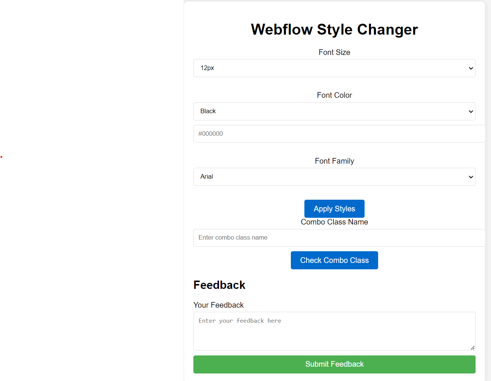

# WebflowStyles

## Overview
WebflowStyles is an extension for Webflow. This extension, written in TypeScript, allows users to dynamically change styles within the Webflow Designer. It offers controls for font size, color, family, and the ability to check for specific combo classes.

## Installation
To install and use WebflowStyles in your Webflow projects, follow these steps:

1. Clone or download the repository from [GitHub](https://github.com/drewhinkson/WebflowStyles).
2. Navigate to the project directory and run `npm install` to install dependencies.
3. Start the development server with `npm run dev`. This will watch for changes in the `src/` folder and recompile TypeScript files, serving your extension files from the `public/` folder.
4. The command outputs a URL under which your extension is being served. Use this as the “Development URL” for your app in the Webflow Designer’s Apps panel.
5. Launch the extension from the Webflow Designer’s Apps panel.

## Usage
Once installed, the WebflowStyles extension provides a user interface with various controls:

- **Font Size Control**: Choose from predefined font sizes.
- **Font Color Control**: Select a color or enter a hex value for font color.
- **Font Family Control**: Select from a list of common font families.
- **Apply Styles Button**: Apply the selected styles to the current element in Webflow.
- **Combo Class Check**: Enter a combo class name to check its existence on the selected element.

## Additional Resources
For more information on creating and using extensions in Webflow, refer to the [Webflow Developer Documentation](https://docs.developers.webflow.com/v2.0.0/docs/create-a-designer-extensions).

